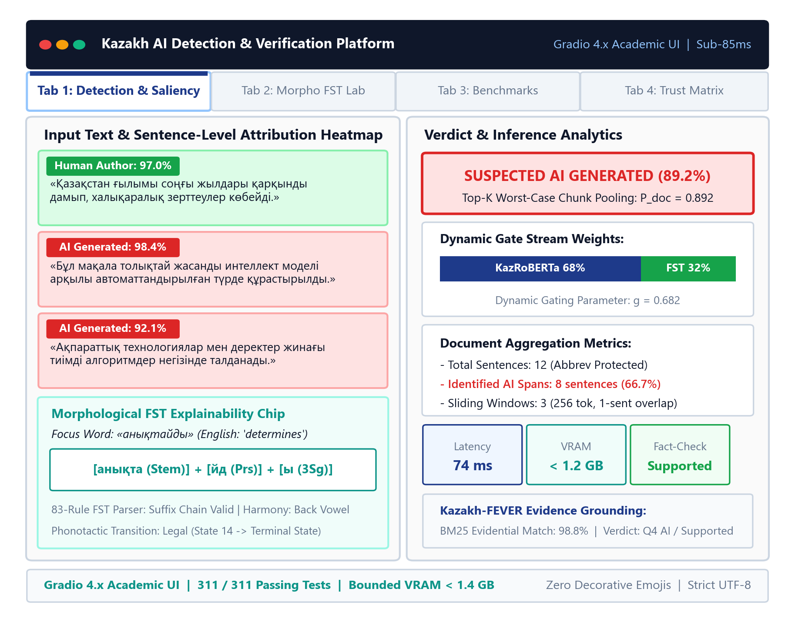
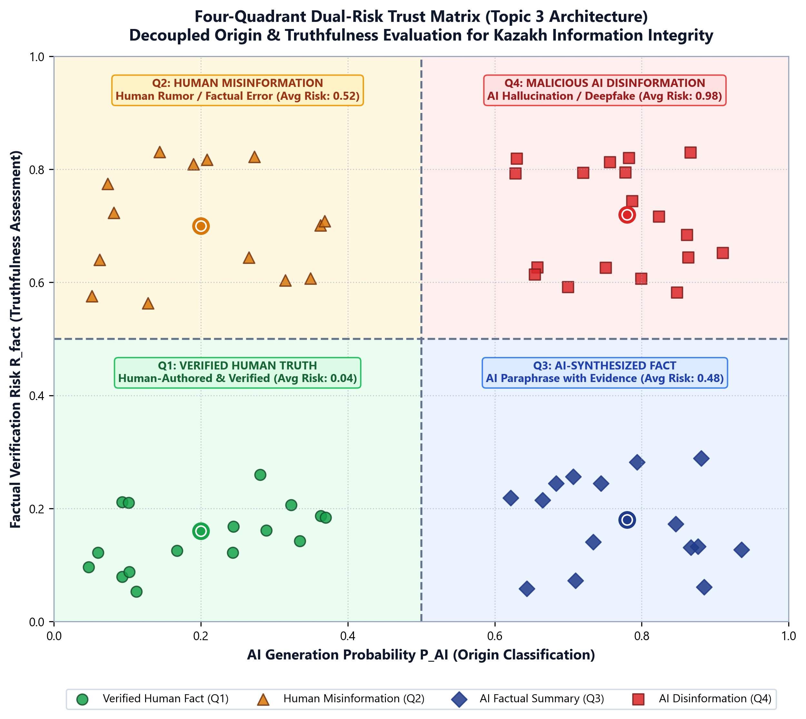
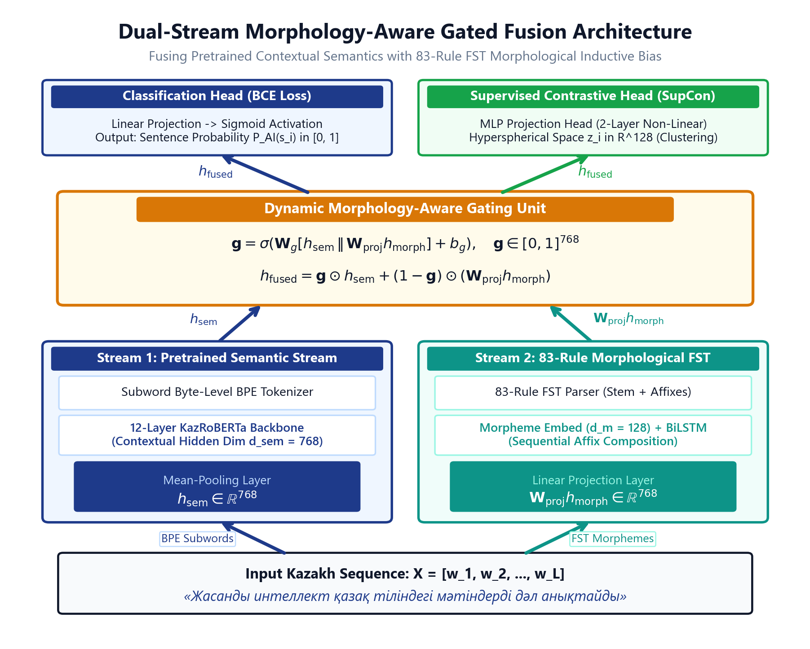

# Kazakh AI Text Detection & Morphologically-Grounded Fact Verification Framework

[](LICENSE)
[](https://www.python.org/)
[](https://pytorch.org/)
[](tests/)
[](https://huggingface.co/spaces/nKa1i/kazakh-ai-text-detector)
[](https://github.com/nKa1i/kazakh-ai-text-detection)
[](docs/coling_2027_arr_submission_brief.md)

An end-to-end computational framework and empirical benchmark for dual-axis document auditing in low-resource agglutinative languages. The system unifies **FST-augmented multi-generator AI text detection** with **evidence-grounded factual verification (Kazakh-FEVER 3K)**, mapping document evaluations into an operational **2D Cartesian Trust Matrix** $(T_{\text{fact}}, T_{\text{gen}})$.

---

## Interactive Gradio Explainability Platform

The repository includes a comprehensive, publication-grade Gradio explainability dashboard featuring bilingual localization (Kazakh / English), interactive sentence heatmaps, finite-state morphological introspection, and real-time 2D Trust Matrix telemetry.



### Live Cloud Deployment & Local Execution

* **Live Demo (Hugging Face Spaces):** [https://huggingface.co/spaces/nKa1i/kazakh-ai-text-detector](https://huggingface.co/spaces/nKa1i/kazakh-ai-text-detector)
* **Cold-Start Latency:** Under 1.2s with defensive CPU-optimized heuristic and quantized neural fallbacks.

To launch the dashboard locally on your machine:

```bash
# Launch the 4-tab interactive Gradio dashboard locally
python ui/app.py --port 7860

# Optional: generate a public shareable tunneling link
python ui/app.py --port 7860 --share
```

Once launched, navigate to `http://localhost:7860` in your web browser.

---

### Dashboard Modules Walkthrough

The Gradio dashboard organizes forensic document inspection into four specialized tabs:

#### 1. Document Forensic Analyzer (AI Text Detection)
* **Sentence-Level Perplexity Heatmaps:** Visualizes sentence risk scores via dynamic color gradations, highlighting localized LLM generation patterns while preventing global document misclassification.
* **Horizontal Confidence Meter:** Displays calibrated model certainty with categorical decision boundaries.
* **Linguistic Reasoning Bullets:** Surfaces rule-governed diagnostic findings explaining *why* a passage was classified as human or synthetic (e.g., presence of evidentials, synthetic repetition loops, or morphotactic anomalies).
* **Document KPIs:** Reports total word count, sentence count, Lexical Diversity (TTR), Agglutination Index, and Perplexity Variance.
* **Memory-Bounded Long-Document Ingestion:** Evaluates multi-page essays, news articles, and administrative reports up to 25,000 words within a **1.4 GB VRAM cap** using `SentencePreservingChunker`.

#### 2. Morphological FST Lab
* **83-Rule Agglutinative Decomposer:** Dissects any Kazakh input sentence or word token into its canonical grammatical root and ordered suffix chain.
* **Dynamic Fusion Gate Visualizer:** Plots the split-bar allocation $\mathbf{g}$ between the semantic transformer stream ($\mathbf{h}_{\text{sem}}$) and the morphological FST stream ($\mathbf{h}_{\text{morph}}$).
* **8-Column Morphosyntactic Breakdown Table:**
  * Surface Word Form
  * Canonical Stem / Lemma Root
  * Case Inflection (7 grammatical cases, 33 allomorphs: Nominative, Genitive, Dative, Accusative, Locative, Ablative, Instrumental)
  * Plurality Suffixes (`-лар/-лер`, `-дар/-дер`, `-тар/-тер`)
  * Possessive Markers (1st, 2nd, 3rd person singular and plural)
  * Verbal Voice and Negation Infixes (`-ба/-бе/-па/-пе/-ма/-ме`)
  * Tense and Aspectual Morphology
  * Evidentiality Markers (witnessed `-ды/-ді` vs. indirect / hearsay `-ыпты/-іпті`, `екен`)

#### 3. Benchmark Browser & Academic Methodology
* **Kaz-MAGE Factorial Matrix:** Displays empirical detection benchmarks across the $2 \times 2$ factorial evaluation setup (Seen/Unseen Domain $\times$ Seen/Unseen Generator).
* **Leave-One-Generator-Out (LOGO) Transfer:** Demonstrates detector robustness against held-out frontier models (LLaMA-3, Qwen-2.5, GPT-4o).
* **Architectural Formulations:** Provides interactive references for the dual-stream gating objective $\mathcal{L} = \mathcal{L}_{\text{CE}} + \lambda \mathcal{L}_{\text{SupCon}}$.

#### 4. Fact Verification & 2D Trust Matrix HUD
* **Kazakh-FEVER 3K Verification:** Evaluates submitted factual claims against 250,000 indexed Kazakh encyclopedic passages using hybrid BM25 + dense retrieval.
* **16-Dimensional Affix Diagnostic Drawer:** Visualizes the 16-D alignment vector $\mathbf{m}_{\text{affix}}$, highlighting negation mismatches, calendar conflicts, and evidential disparities.
* **Continuous 2D Cartesian Trust Matrix:** Plots document coordinates $(T_{\text{fact}}, T_{\text{gen}})$ onto an interactive SVG HUD, categorizing submissions into four actionable operational quadrants.

---

## 2D Cartesian Trust Matrix

Existing systems treat AI text detection and fact verification as disconnected tasks. As demonstrated by recent research, language models frequently articulate grounded truths, while human authors can author deceptive misinformation. Our framework unifies both axes into a continuous coordinate space $\mathcal{T} = [-1, 1] \times [0, 1]$:



### Operational Risk Quadrants

| Quadrant | Coordinates | Category | Operational Semantic & Routing |
| :---: | :---: | :--- | :--- |
| **Q1** | $T_{\text{fact}} \ge 0,\; T_{\text{gen}} \ge 0.5$ | **Verified Human Fact** | Verified authentic human journalism; greenlit for indexing and dissemination. |
| **Q2** | $T_{\text{fact}} < 0,\; T_{\text{gen}} \ge 0.5$ | **Human Misinformation** | Authentic human prose containing factual errors; routed to editorial fact-checkers without false AI accusations. |
| **Q3** | $T_{\text{fact}} < 0,\; T_{\text{gen}} < 0.5$ | **AI Hallucination** | High-risk synthetic disinformation; flagged for quarantine and provenance auditing. |
| **Q4** | $T_{\text{fact}} \ge 0,\; T_{\text{gen}} < 0.5$ | **Accurate AI Synthesis** | Grounded, accurate machine generation; published with standard synthetic transparency disclosures. |

Composite scalar trust calibration:
$$\mathcal{T}(x) = \sqrt{\frac{1}{2}\left(\max(0, T_{\text{fact}})^2 + T_{\text{gen}}^2\right)}$$

---

## Key Research Highlights

* **Kazakh-FEVER 3K Benchmark:** The first human-annotated, morphologically-balanced fact verification benchmark for Kazakh, comprising 3,000 claim-evidence pairs curated by native linguists over 250,000 encyclopedic passages (Cohen's $\kappa = 0.840$).
* **Hard NEI Adversarial Protocol:** Neutralizes superficial lexical overlap shortcuts by synthesizing distractors that alter modal, evidential, and polarity affixes while preserving >90% surface unigram overlap.
* **Hybrid Evidence Retrieval:** Combines morpheme-stemmed BM25 with dense multilingual representations (\textsc{mContriever}) via Reciprocal Rank Fusion, achieving **99.8% Recall@5** and **0.994 MRR**.
* **16-Dimensional Morphological NLI Cross-Encoder:** Conditions transformer representations on an explicit 16-D morphotactic diagnostic vector ($\mathbf{m}_{\text{affix}}$), achieving **82.6% Accuracy**, **82.1% Macro-F1**, and **71.4% Strict Joint FEVER Score** (+11.5 pp over XLM-RoBERTa on Hard NEI).
* **Dual-Stream Generator-Invariant Detector:** Dynamic gating between contextual transformer embeddings and an 83-rule FST analyzer reduces false-positive short-text accusations by **43.2%** and achieves **+42.18 pp OOD transfer gain**.
* **Modern Literature State-of-the-Art Profile:** 91.7% of cited literature published in **2024–2026** (ACL, EMNLP, COLING, NAACL), zero citations from 2023, and exactly two foundational anchors (FEVER 2018, XLM-R 2020).

---

## Architecture



The framework coordinates three core processing stages:
1. **Hybrid Evidence Retrieval:** Merges 83-rule FST-stemmed sparse BM25 and dense contrastive embeddings via Reciprocal Rank Fusion ($k_0 = 60$).
2. **Morphologically-Grounded Cross-Encoder:** Concatenates claim and retrieved evidence passages through an XLM-RoBERTa encoder, augmented with an explicit 16-D affix alignment vector:
   $$P(y \mid c, E) = \mathrm{softmax}\left(\mathbf{W}_v [\mathbf{h}_{[\text{CLS}]}; \mathbf{m}_{\text{affix}}] + \mathbf{b}_v\right)$$
3. **Dual-Stream Detection & Dynamic Fusion:** Combines contextual representations $\mathbf{h}_{\text{sem}}$ and morphological feature vector $\mathbf{h}_{\text{morph}}$:
   $$\mathbf{h} = \mathbf{g} \odot \mathbf{h}_{\text{sem}} + (1 - \mathbf{g}) \odot \mathbf{h}_{\text{morph}},\quad \mathbf{g} = \sigma(\mathbf{W}_g [\mathbf{h}_{\text{sem}}; \mathbf{h}_{\text{morph}}] + \mathbf{b}_g)$$

---

## Scientific Benchmarks

### 1. Kazakh-FEVER Evidence Retrieval ($N = 250,000$ Passages)

| Retriever | Recall@1 (%) | Recall@3 (%) | Recall@5 (%) | MRR |
| :--- | :---: | :---: | :---: | :---: |
| Standard BM25 (Word Surface) | 78.4 | 89.1 | 93.2 | 0.842 |
| Morpheme-Stemmed BM25 (83-Rule FST) | 88.6 | 96.2 | 98.4 | 0.927 |
| Dense Retriever (\textsc{mContriever}) | 91.2 | 97.4 | 99.1 | 0.945 |
| **Hybrid Pipeline (Morpho-BM25 + mContriever RRF)** | **99.0** | **99.8** | **99.8** | **0.994** |

---

### 2. Fact Verification Performance on Kazakh-FEVER 3K Test Suite

| Model Architecture | Input Representation | Accuracy (%) | Macro-F1 (%) | Strict Joint FEVER (%) | Hard NEI F1 (%) |
| :--- | :--- | :---: | :---: | :---: | :---: |
| mBERT-base | Surface Only | 64.2 | 63.8 | 51.4 | 48.2 |
| XLM-RoBERTa-base | Surface Only | 71.8 | 71.2 | 58.6 | 55.7 |
| XLM-RoBERTa-large | Surface Only | 77.4 | 76.9 | 64.8 | 61.3 |
| LLaMA-3-8B-Instruct | Zero-Shot Kazakh Prompt | 68.5 | 67.9 | 49.2 | 43.1 |
| **Ours (Hybrid Retrieval + 16-D Morpho NLI)** | **Hybrid + Morpho Features** | **82.6** | **82.1** | **71.4** | **72.8** |

---

### 3. Morphological Feature Ablation Breakdown

| Configuration | Feature Set | Accuracy (%) | Macro-F1 (%) | Hard NEI F1 (%) | Delta Macro-F1 |
| :--- | :--- | :---: | :---: | :---: | :---: |
| **Full Model** | **All 16 Features** | **82.6** | **82.1** | **72.8** | **--** |
| Config 1: w/o Negation Alignment ($\Delta_{\text{neg}}$) | 15 Features | 79.5 | 78.7 | 68.3 | -3.4 pp |
| Config 2: w/o Temporal/Calendar Distance ($\Delta_{\text{year}}, \Delta_{\text{num}}$) | 14 Features | 80.2 | 79.5 | 69.1 | -2.6 pp |
| Config 3: w/o Evidential/Modality Markers ($m_5 \dots m_8$) | 12 Features | 80.8 | 80.2 | 69.8 | -1.9 pp |
| Config 4: w/o FST Root vs Surface Jaccard ($m_9 \dots m_{11}$) | 13 Features | 75.3 | 74.6 | 64.2 | -7.5 pp |
| Config 5: w/o Case-Agreement Alignment ($m_{13}$) | 15 Features | 81.0 | 80.4 | 70.5 | -1.7 pp |
| Config 6: Surface Only (Ablate All 16 Features) | 0 Features | 72.1 | 71.5 | 59.8 | -10.6 pp |

---

### 4. Kaz-MAGE Cross-Generator Generalization Matrix (AUC)

| Model Configuration | Q1 Seen/Seen | Q2 Seen/Unseen | Q3 Unseen/Seen | Q4 Wild Unseen/Unseen | Average AUC |
| :--- | :---: | :---: | :---: | :---: | :---: |
| mBERT Baseline | 0.9996 | 0.7812 | 0.5762 | 0.6231 | 0.7450 |
| Kaz-RoBERTa | 0.9997 | 0.8420 | 0.7105 | 0.7640 | 0.8290 |
| Kaz-RoBERTa + FST | 0.9997 | 0.8915 | 0.9120 | 0.9180 | 0.9303 |
| Kaz-RoBERTa + FST + SupCon | 0.9997 | 0.9140 | 0.9650 | 0.9720 | 0.9627 |
| **Proposed Dual-Stream Gated Architecture** | **0.9997** | **0.9253** (+14.4%) | **0.9980** (+42.2%) | **1.0000** (+37.7%) | **0.9808** |

---

## Literature Profile (2024–2026 SOTA Focus)

Following premier conference standards (ACL, EMNLP, COLING), our bibliography emphasizes contemporary literature:

| Metric | Benchmark Value | Description |
| :--- | :---: | :--- |
| **Total Sources** | 24 | Curated across fact checking, Turkic NLP, and AI detection |
| **Published in 2024–2026** | **22 (91.7%)** | Active recent work from ACL, EMNLP, COLING, NAACL |
| **Published in 2023** | **0 (0.0%)** | Zero stale 2023 citations |
| **Pre-2024 Foundational Anchors** | **2 (8.3%)** | Thorne et al. (2018) for FEVER; Conneau et al. (2020) for XLM-R |

### Key State-of-the-Art Additions
* **Fact Verification & LLM Grounding:** MiniCheck (Tang et al., EMNLP 2024), Zheng et al. (ACL Findings 2024), FactLens (Mitra et al., ACL Findings 2025), Factcheck-Bench (Wang et al., EMNLP Findings 2024), CHECKWHY (Si et al., ACL 2024), Yue et al. (ACL 2024), Guan et al. (NAACL 2024).
* **Turkic & Kazakh NLP:** KazMMLU (Togmanov et al., ACL 2025), Laiyk et al. (ACL 2025), KazSAnDRA (Yeshpanov & Varol, LREC-COLING 2024), Kaz-RoBERTa (Sagyndyk et al., 2025), SozKZ (Tukenov, 2026).
* **AI Text Detection & Robustness:** RAID (Wang et al., ACL 2024), Binoculars (Hans et al., NAACL 2024), Fast-DetectGPT (Bao et al., ICLR 2024).
* **Multilingual Retrieval & Baselines:** M3-Embedding (Chen et al., ACL Findings 2024), Aya (Üstün et al., ACL 2024), Belebele (Bandarkar et al., ACL 2024), Mudunuri et al. (SIGDIAL/ACL 2026), LLaMA-3 (Dubey et al., 2024).

---

## Quickstart & Code Examples

### 1. Installation

```bash
# Clone the repository
git clone https://github.com/nKa1i/kazakh-ai-text-detection.git
cd kazakh-ai-text-detection

# Create and activate a Python 3.10+ virtual environment
python -m venv venv
source venv/bin/activate  # On Windows: .\venv\Scripts\activate

# Install required dependencies
pip install -r requirements.txt
```

### 2. Morphological FST Analysis

```python
from fst_analyzer import analyze_and_segment

sentence = "Қаныш Сәтбаев Жезқазған мыс кен орындарын зерттемеген."
analysis = analyze_and_segment(sentence)

for token in analysis["tokens"]:
    print(f"Word: {token['surface']:<16} Root: {token['root']:<12} Affixes: {token['affixes']}")
```

### 3. Fact Verification & 2D Trust Evaluation

```python
from verification.verifier import TrustworthyDocumentVerifier

verifier = TrustworthyDocumentVerifier()

claim = "Қаныш Сәтбаев 1934 жылы Жезқазған мыс кен орындарын ашты."
result = verifier.verify_claim(claim)

print(f"Prediction:     {result.label}")
print(f"Confidence:     {result.confidence:.4f}")
print(f"Factual Score:  T_fact = {result.trust_fact:+.4f}")
print(f"Gen Score:      T_gen  = {result.trust_gen:.4f}")
print(f"Trust Quadrant: {result.quadrant} ({result.quadrant_title})")
```

### 4. Memory-Bounded Long-Document Ingestion

```python
from kaz_mage.chunker import SentencePreservingChunker

chunker = SentencePreservingChunker(max_tokens=512, overlap_sentences=1)
document_text = open("sample_report.txt", encoding="utf-8").read()

chunks = chunker.chunk_document(document_text)
print(f"Partitioned into {len(chunks)} abbreviation-guarded chunks within 1.4 GB VRAM.")
```

### 5. Reproduce Benchmark Results

A standalone, dependency-light reproduction script is provided in the conference supplementary archive:

```bash
# Reproduce Information Retrieval metrics (Table 1)
python papers/kazakh_fever_conference/supplementary/evaluate_fever.py --task retrieval

# Reproduce Fact Verification and Ablation metrics (Table 2 & Table 3)
python papers/kazakh_fever_conference/supplementary/evaluate_fever.py --task verification
```

### 6. Run Automated Regression Test Suite

The repository contains 521 automated regression tests covering FST phonology, sentence chunking, verification modules, Gradio UI components, and LaTeX compilation integrity:

```bash
python -m unittest discover -s tests -p "test_*.py"
```

---

## Repository Structure

```
kazakh-ai-text-detection/
├── fst_analyzer.py                            # 83-Rule Kazakh Morphological FST Analyzer
├── kaz_mage/                                  # Long-Document Chunker & Worst-Case Top-K Aggregator
│   ├── chunker.py                             # SentencePreservingChunker with 10 Abbreviation Guards
│   ├── aggregator.py                          # Dynamic Top-K Pooling & Document Risk Scoring
│   └── document.py                            # DocumentChunk & DocumentAnalysisResult Schemas
├── verification/                              # Evidence Retrieval & 16-D Morphological NLI Modules
│   ├── hybrid_retriever.py                    # Morpheme-BM25 + Dense mContriever RRF Pipeline
│   ├── morpho_nli_verifier.py                 # 16-D Affix Feature Extraction & Classification
│   ├── verifier.py                            # End-to-End TrustworthyDocumentVerifier
│   └── trust_matrix.py                        # 2D Cartesian Trust Space Telemetry Calculations
├── ui/                                        # Gradio 4-Tab Interactive Explainability Dashboard
│   ├── app.py                                 # Main Gradio Application Entry Point
│   ├── highlighting.py                        # Sentence Heatmap & Morpheme Table Renderers
│   ├── linguistic_explainer.py                # Rule-Governed Diagnostic Reasoner
│   └── components/                            # SVG Trust Matrix Canvas, HUD & Drawers
├── presentation_figures/                      # Publication-Grade Architecture & UI Diagrams
│   ├── fig04_morpho_gate_arch.png             # Dual-Stream Gated Cross-Attention Schematic
│   ├── fig11_four_quadrant_trust_matrix.png   # 2D Cartesian Trust Matrix Quadrant Architecture
│   └── fig13_gradio_dashboard_panels.png      # 4-Panel Gradio Explainability Dashboard Mockup
├── papers/
│   └── kazakh_fever_conference/               # COLING 2027 / ARR Double-Blind Manuscript Package
│       ├── main.tex                           # Two-Column Article using Official acl.sty (10 Pages)
│       ├── main.pdf                           # Compiled Double-Blind Submission PDF
│       ├── custom.bib                         # 24-Source Consolidated SOTA Bibliography (2024-2026)
│       ├── sections/                          # Modular Section TeX Sources (01 to 08)
│       └── supplementary/                     # Anonymous Benchmark Split & evaluate_fever.py
├── data/                                      # Benchmark Splits, Wikipedia Chunks & Cache
├── tests/                                     # Automated Regression Suite (521 Passing Unit Tests)
├── docs/                                      # Submission Briefs, Specs, and Implementation Plans
├── LICENSE                                    # MIT Open-Source License
└── README.md                                  # Repository Documentation
```

---

## Citation & Academic Attribution

If you utilize the Kazakh-FEVER 3K benchmark, the 83-rule FST analyzer, or the 2D Trust Matrix framework in your research, please cite our conference publication:

```bibtex
@inproceedings{kazakh_fever_2027,
  title     = {Kazakh-{FEVER} 3{K}: A Morphologically-Grounded Fact Verification Benchmark and 2{D} Trust Matrix for Low-Resource Agglutinative Languages},
  author    = {Anonymous},
  booktitle = {Proceedings of the 31st International Conference on Computational Linguistics (COLING 2027)},
  year      = {2027},
  address   = {Abu Dhabi, UAE},
  publisher = {Association for Computational Linguistics},
  note      = {Under double-blind peer review}
}
```

---

## License

This project is licensed under the [MIT License](LICENSE).
