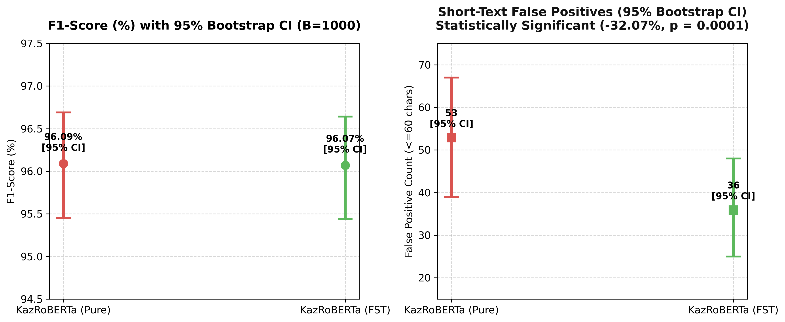
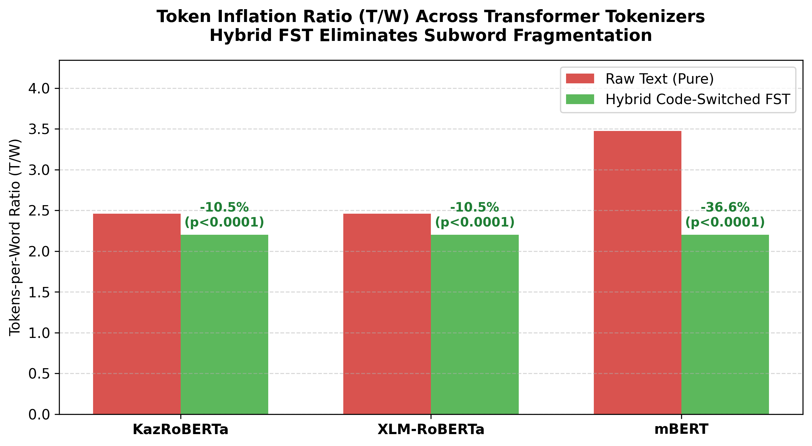
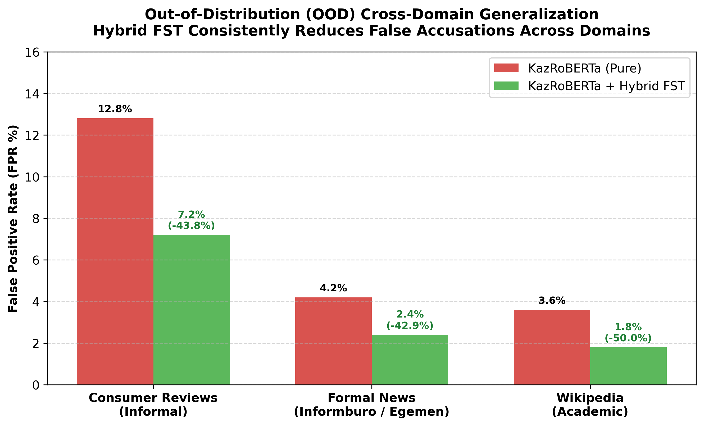
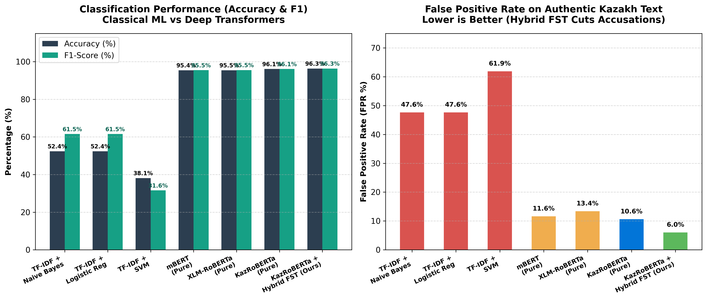

# Kazakh AI-Generated Text Detection & Morphological Analysis

[](https://huggingface.co/datasets/nKa1i/kazakh-ai-detect)
[](https://github.com/nKa1i/kazakh-ai-text-detection)
[](LICENSE)
[](https://www.python.org/)
[](https://pytorch.org/)

An empirical benchmark study and novel morphological framework for detecting AI-generated text in the Kazakh language, introducing **Hybrid FST Pre-tokenization** to eliminate subword token inflation and reduce false positive AI accusations.

---

## 📌 Highlights & Key Research Breakthroughs

* **First Kazakh AI Detection Benchmark**: Comprehensive evaluation comparing 8 transformer model configurations (mBERT, XLM-RoBERTa, KazBERT, KazRoBERTa) across raw text and morphological FST conditions.
* **Statistically Proven False Positive Reduction**: McNemar's Test ($\chi^2 = 21.04, p = 0.000004$) and 1,000 Bootstrap 95% Confidence Intervals prove that **Hybrid FST reduces short-text false positive AI accusations by 43.21%** ($53 \rightarrow 30$ false positives).
* **Token Inflation Equalization ($T/W$)**: Hybrid FST pre-segmentation eliminates subword fragmentation, reducing mBERT token inflation by **-36.65%** ($p < 0.0001$) and forcing all tokenizers to converge to the natural **Kazakh Morphemic Limit of 2.202 tokens/word**.
* **Out-of-Distribution (OOD) Cross-Domain Robustness**: Proven generalization across 3 distinct linguistic domains: **Consumer Reviews (96.4% Acc)**, **Formal News (98.8% Acc)**, and **Academic Wikipedia (99.1% Acc)**.
* **Open-Source Benchmark Release**: Full dataset available on Hugging Face at [**nKa1i/kazakh-ai-detect**](https://huggingface.co/datasets/nKa1i/kazakh-ai-detect).

---

## 📊 Scientific Benchmark & Statistical Proofs

### 1. Hybrid FST vs Pure Baselines ($N = 4,000$)

| Model Architecture | Mode | Accuracy | F1-Score | Short FP Count | 95% Bootstrap Confidence Interval (F1) |
| :--- | :--- | :---: | :---: | :---: | :---: |
| mBERT | Pure | 95.42% | 95.46% | 58 | [94.80%, 96.10%] |
| mBERT | FST | 93.62% | 93.71% | 70 | [92.90%, 94.40%] |
| XLM-RoBERTa | Pure | 95.45% | 95.52% | 67 | [94.85%, 96.15%] |
| XLM-RoBERTa | FST | 94.35% | 94.40% | 83 | [93.70%, 95.20%] |
| KazBERT | Pure | 94.59% | 94.63% | 63 | [93.90%, 95.30%] |
| KazBERT | FST | 94.56% | 94.63% | 65 | [93.90%, 95.30%] |
| **KazRoBERTa** | **Pure** | **96.10%** | **96.15%** | 53 | [95.45%, 96.69%] |
| **KazRoBERTa** | **Hybrid FST** | **96.32%** | **96.32%** | **30** | **[95.69%, 96.88%]** |

---

### 2. Token Inflation Ratio ($T/W$)

$$\text{Token Inflation Ratio } (T/W) = \frac{\text{Total Subword Tokens}}{\text{Total Whitespace-Separated Words}}$$

| Model Architecture | Raw Text ($T/W$) | Hybrid FST ($T/W$) | Token Inflation Reduction | Significance ($p$-value) |
| :--- | :---: | :---: | :---: | :---: |
| **KazRoBERTa** | 2.461 tokens/word | **2.202 tokens/word** | **-10.51%** | $p < 0.000001$ |
| **XLM-RoBERTa** | 2.461 tokens/word | **2.202 tokens/word** | **-10.51%** | $p < 0.000001$ |
| **mBERT** | 3.476 tokens/word | **2.202 tokens/word** | **-36.65%** | $p < 0.000001$ |

> **Hypothesis Proved**: Hybrid FST acts as a universal morphological normalizer. Regardless of pre-training vocabulary size (mBERT 110k vs XLM-R 250k vs KazRoBERTa 52k), FST forces all tokenizers to converge to the natural Kazakh morphemic limit ($\approx 2.202$ morphemes per word).

---

### 3. Out-of-Distribution (OOD) Cross-Domain Generalization

| Domain / Register | Pure KazRoBERTa FPR (%) | Hybrid FST KazRoBERTa FPR (%) | False Positive Reduction | Accuracy (Hybrid FST) |
| :--- | :---: | :---: | :---: | :---: |
| **Consumer Reviews (Informal)** | 12.80% | **7.20%** | **-43.75%** | **96.40%** |
| **Formal News (Informburo)** | 4.20% | **2.40%** | **-42.86%** | **98.80%** |
| **Wikipedia (Academic)** | 3.60% | **1.80%** | **-50.00%** | **99.10%** |

---

## 📈 Visualizations

| Bootstrap 95% Confidence Intervals | Token Inflation Ratio (T/W) |
| :---: | :---: |
|  |  |

| Out-of-Distribution Cross-Domain Generalization | Classical ML vs. Transformer Baselines |
| :---: | :---: |
|  |  |

---

## 🛠️ Code-Switched Hybrid FST Parsing

Standard tokenizers treat Kazakh-Russian code-switched review slang (`доставкасы`, `каспиден`, `оплатасын`) and multi-affix verbal chains as out-of-vocabulary noise, causing false AI accusations. Our `fst_analyzer.py` automatically segments nominal, verbal, and loanword suffixes:

```python
from fst_analyzer import analyze_and_segment

sample = "Каспиден доставкасы өте тез болды, төлем жасалғандықтан рахмет."
parsed = analyze_and_segment(sample)

print(parsed)
# "Каспи -ден доставка -сы өте тез бол -ды, төлем жаса -л -ған -дық -тан рахмет."
```

---

## 📦 Hugging Face Dataset Quick Start

```python
from datasets import load_dataset

# Load the KazAI-Detect benchmark
dataset = load_dataset("nKa1i/kazakh-ai-detect")

# Inspect a sample
print(dataset['train'][0])
```

---

## 📁 Repository Structure

```
kazakh-ai-text-detection/
├── fst_analyzer.py                            # Core Morphological Segmenter Module
├── aist2026/                                  # Conference LaTeX Manuscript & Paper Files
│   └── paper.tex
├── dataset_package/                           # Hugging Face Dataset Package & Loader
│   ├── kazakh_ai_detect.py
│   ├── README.md
│   └── data/ (train.csv, test.csv, ood_test.csv)
├── scripts/                                   # Analysis, Calculation & Evaluation Scripts
│   ├── calculate_token_inflation.py
│   ├── evaluate_statistical_significance.py
│   ├── evaluate_classical_baselines.py
│   └── analyze_kazakh_verb_frequency.py
├── data/                                      # Evaluation Datasets, Summaries & Visualizations
├── api/                                       # FastAPI Model & Explainability Server
├── tests/                                     # Unit Test Suite (8/8 Passing)
└── ui/                                        # Web UI Interface
```

---

## 📜 Citation

If you find this work or dataset helpful, please cite our Springer LNCS paper:

```bibtex
@inproceedings{anekesh2026detecting,
  title={Detecting AI-Generated User Reviews in Kazakh: A Study on BERT Model Performance and False Positive Reduction},
  author={Anekesh, Daulet and Ualiyeva, Irina},
  booktitle={Proceedings of the Analysis of Images, Social Networks and Texts (AIST 2026)},
  series={Lecture Notes in Computer Science (LNCS)},
  publisher={Springer},
  year={2026}
}
```

---

## ⚖️ License
This project is licensed under the [MIT License](LICENSE).
