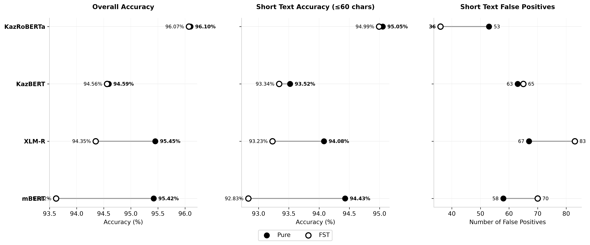

# Detecting AI-Generated User Reviews in Kazakh: A Study on BERT Model Performance and False Positive Reduction

**Authors:** Daulet Anekesh, Irina Ualiyeva  
*Al-Farabi Kazakh National University (KazNU)*  
*Contact: anekeshd@gmail.com, i.ualiyeva@gmail.com*

---

### Abstract
The rapid rise of generative Artificial Intelligence (AI) has accelerated the need for reliable machine-generated text detectors. However, research remains highly limited for low-resource and morphologically rich languages such as Kazakh. In this paper, we present a systematic benchmark study for detecting AI-generated user reviews in the Kazakh language. We construct a domain-aligned dataset using real-world human reviews from the KazSAnDRA dataset [1] and pair them with AI-generated counterparts produced by a Kazakh-specific Large Language Model (LLM), carefully seeded to match length, domain, and register.

We benchmark four transformer-based models—multilingual (mBERT [2], XLM-R [3]) and monolingual (KazBERT [4], KazRoBERTa [5])—under two distinct conditions: a baseline trained on raw text (Pure) and a model trained on morphologically segmented text (FST) utilizing a rule-based Finite-State Transducer to separate stems from suffixes [6]. Our evaluation shows that monolingual pretraining significantly outperforms early multilingual models, with KazRoBERTa (Pure) achieving the highest overall accuracy of 96.10% (F1-score of 96.15%). While explicit morphological segmentation does not improve overall detection accuracy, it dramatically reduces false positive rates on short texts. Specifically, KazRoBERTa (FST) reduces false positives by 32% (from 53 to 36 cases) compared to its Pure baseline. We recommend the Pure model for accuracy-first deployments and the FST-augmented model for precision-critical applications to minimize false accusations of AI usage.

**Keywords:** AI-generated text detection, Kazakh language, BERT models, Finite-State Transducer (FST), morphological analysis, KazSAnDRA, low-resource NLP

---

## 1. Introduction
The advent of Large Language Models (LLMs) has fundamentally transformed the landscape of content creation, offering unprecedented capabilities in text generation across various domains. While these models offer immense productivity gains, they also raise serious concerns regarding academic integrity, disinformation dissemination, and spam generation. Consequently, building automated systems capable of distinguishing between human-written and AI-generated texts has become a pressing necessity.

However, the majority of research in AI-generated text detection focuses on high-resource languages such as English. Low-resource and morphologically rich languages remain underrepresented. Kazakh is a prime example of such a language. As a Turkic language, Kazakh features an agglutinative morphology where words are formed by appending multiple suffixes (indicating case, possession, plurality, etc.) to a root stem. This structure results in a massive vocabulary size and high out-of-vocabulary (OOV) rates, creating significant challenges for standard subword tokenizers used in state-of-the-art transformer models.

Moreover, a critical but often overlooked challenge in deploying AI detectors is the rate of false positives—cases where authentic human writing is incorrectly flagged as machine-generated. False accusations can lead to severe reputational, academic, or professional consequences for individuals. This problem is particularly acute for short texts (e.g., product reviews, social media comments), where the lack of context makes detection highly volatile.

In this study, we present a systematic benchmark of transformer-based models for detecting AI-generated user reviews in the Kazakh language. We analyze the performance of two multilingual models (mBERT [2] and XLM-RoBERTa [3]) and two monolingual models (KazBERT [4] and KazRoBERTa [5]). Furthermore, we propose integrating a rule-based Finite-State Transducer (FST) morphological analyzer [6] to segment suffixes from stems prior to tokenization. Our results reveal that while monolingual models achieve superior raw performance, the integration of FST morphological analysis provides a robust defense against false positives, reducing false positive cases on short texts by 32% for the top-performing KazRoBERTa model.

---

## 2. Related Work
AI-generated text detection has evolved from statistical methods to deep learning classifiers and generation-phase watermarking. Early statistical baselines like the Giant Language Model Test Room (GLTR) [8] utilize token rank and entropy to distinguish human text from machine text, based on the assumption that LLM generations tend to use highly predictable words (high probability). Supervised classifiers, such as RoBERTa-based models fine-tuned on human and GPT-generated outputs [10], have demonstrated high accuracy in learning implicit features of LLM styles. Additionally, watermarking techniques, such as the one proposed by Kirchenbauer et al. [9], embed cryptography-based watermarks in the text distribution at generation time to enable public verification of machine authorship. More recently, black-box detectors like DetectGPT [7] utilize probability curvatures to identify machine authorship, but they assume zero-shot access to LLM token probabilities, which is rarely feasible in commercial API detection settings where black-box classification is required.

In low-resource NLP, research has concentrated on building monolingual models to capture native syntax and semantics. For the Kazakh language, models like KazBERT [4] (developed by Eraly-ml) and KazRoBERTa [5] (a conversational model by kz-transformers) have been introduced to improve downstream tasks such as sentiment analysis, named entity recognition, and spelling correction. However, benchmarking these models for AI-generated text detection remains unexplored.

Agglutinative languages pose unique morphological hurdles. Turkic languages like Turkish, Uzbek, and Kazakh feature complex suffixation rules. Previous research in Turkic NLP has demonstrated that rule-based morphological segmentation can alleviate vocabulary sparsity. Tyers and Washington [6] developed open-source finite-state morphological transducers for Kypchak languages (Kazakh, Tatar, and Kumyk) using the Helsinki Finite-State Toolkit (HFST) utilizing the `lexc` formalism for morphotactics and `twol` for morphophonology. While data-driven morphological analysis has been proposed to handle out-of-vocabulary issues [11], rule-based FST approaches remain highly precise. In this work, we investigate whether separating stems from grammatical suffixes helps transformer models learn stylistic boundaries between human and LLM-generated Kazakh text.

---

## 3. Dataset Construction & Model Rundown

### 3.1 Dataset Construction
To construct a realistic evaluation corpus, we aligned human-written Kazakh reviews with LLM-generated counter-examples:
- **Human Corpus:** Sourced from **KazSAnDRA** (Kazakh Sentiment Analysis Dataset of Reviews and Attitudes) [1]. Introduced by Yeshpanov and Varol (2024), KazSAnDRA is a large-scale corpus containing 180,064 consumer reviews. The reviews span four distinct domains to ensure high vocabulary diversity: **Appstore** (reviews for Android applications), **Bookstore** (feedback on Kazakh audiobooks and text materials), **Mapping** (comments on digital navigation and maps), and **Market** (reviews from e-commerce platforms).
- **AI Corpus:** Generated using a Kazakh-specific Large Language Model. To ensure the dataset represents a challenging detection task, the AI generator was seeded with the same domain topics, and the generation parameters were set to match the length and register (informal vs. formal) of the corresponding human reviews.
- **Dataset Splits:** The combined corpus contains a training set of 8,848 samples and a held-out evaluation test set of 984 samples. A text is classified as "Short" if it is <= 60 characters, and "Long" if it is > 60 characters.

#### Example of a Human Review.
Below is an authentic review from the e-commerce App segment of the KazSAnDRA dataset:
> *"Каспи редті клиентке үлкен суммаға ашқызғандарың адамгершілікке жатпайды (недобросовестно). Кішкентай соманы менюдің бір жеріне тығып қойыпсыңдар. Білетін, шұқылайтын адам болмаса қораға кіргізіп тұрсыңдар ғой. Айтса айтты дейсіңдер. Плюсі, жылдам істейді."*  
> *(Translation: "Opening a Kaspi Red for a client with a large sum is not humane (unfair). You hid the small sum somewhere in the menu. If someone doesn't know and dig into it, you're trapping them... Plus, it works fast.")*

This example highlights the informal review style, the presence of code-switched Russian terms (e.g., *"недобросовестно"*), and highly agglutinative Kazakh morphological structures (e.g., *"ашқызғандарың"*, *"тығып қойыпсыңдар"*).

### 3.2 Benchmark Models
We evaluate four distinct transformer architectures to explore the trade-offs between multilingualism and monolingual pretraining:
1. **mBERT (bert-base-multilingual-cased) [2]:** Pretrained on 104 languages, including Kazakh, utilizing a shared multilingual vocabulary of 119,547 tokens.
2. **XLM-RoBERTa (xlm-roberta-base) [3]:** A larger multilingual model trained on CommonCrawl data in 100 languages, optimized for cross-lingual transfer.
3. **KazBERT (Eraly-ml/KazBERT) [4]:** A monolingual BERT model pretrained specifically on Kazakh Wikipedia and Common Crawl text corpora, utilizing a custom WordPiece tokenizer.
4. **KazRoBERTa (kz-transformers/kaz-roberta-conversational) [5]:** A monolingual base-sized RoBERTa model. As detailed in its technical report by Sagyndyk et al. (2025), the model was pretrained from scratch on a 25GB corpus combining MDBKD (Multi-Domain Bilingual Kazakh Dataset) containing 24.8 million texts and Telecom customer-support dialogues from Beeline KZ (2016–2023). It features a 52,000-token BPE vocabulary, 6 hidden layers, 12 attention heads, and a hidden dimension of 768. It was trained using a Masked Language Modeling (MLM) objective with a 15% masking probability for 500k steps with a batch size of 128 and sequence length of 512.

---

## 4. Methodology: FST Morphological Analyzer
Agglutinative languages exhibit a high degree of suffixation. For example, the Kazakh word *"жазбаларыңыздан"* (from your writings) is composed of:
- Root stem: **жазба** (writing)
- Plural suffix: **-лар** (plural marker)
- Possessive suffix: **-ыңыз** (your, formal)
- Ablative case suffix: **-дан** (from)

Standard subword tokenizers (like WordPiece or Byte-Pair Encoding) often segment such words arbitrarily (e.g., *"жаз" + "бала" + "рыңыздан"*), which destroys semantic and morphological boundaries. To solve this, we implement a rule-based **Advanced Kazakh FST Analyzer** modeled after the finite-state morphological rules used in Kypchak transducers [6]. Unlike full morphological parsers that handle complex verbal paradigms and root alternations, our analyzer targets the nominal suffix hierarchies to specifically address the vocabulary sparsity found in short user reviews.

The analyzer isolates suffixes belonging to three primary grammatical categories:
1. **Plurals:** `-лар`, `-лер`, `-дар`, `-дер`, `-тар`, `-тер`.
2. **Possessives:** `-мыз`, `-міз`, `-ңыз`, `-ңіз`, `-ымыз`, `-іміз`, `-ыңыз`, `-іңіз`, `-лары`, `-лері`, `-дары`, `-дері`, `-тары`, `-тері`, `-м`, `-ң`, `-ы`, `-і`.
3. **Cases (Genitive, Dative, Accusative, Locative, Ablative, Instrumental):** `-ның`, `-нің`, `-дың`, `-дің`, `-тың`, `-тің`, `-ға`, `-ге`, `-қа`, `-ке`, `-на`, `-не`, `-ны`, `-ні`, `-ды`, `-ді`, `-ты`, `-ті`, `-да`, `-де`, `-та`, `-те`, `-нда`, `-нде`, `-дан`, `-ден`, `-тан`, `-тен`, `-нан`, `-нен`, `-мен`, `-бен`, `-пен`.

### Segmentation Example:
- **Original:** *"Бұл жазбаларыңыздан AI арқылы жасалғандықтан, оларды тексеру керек."*
- **FST Processed:** *"Бұл жазба -лар -ыңыз -дан AI арқылы жасалғандықтан, олар -ды тексеру керек."*

By separating the grammatical suffixes, the transformer models can learn separate embeddings for the core semantic root and the syntactic suffixes, reducing OOV occurrences and enhancing classification precision.

---

## 5. Experimental Setup
We evaluate each of the four models under two experimental configurations:
- **Pure Mode:** The models are trained and evaluated on the raw Kazakh text.
- **FST Mode:** The raw text is preprocessed using the `AdvancedKazakhFSTAnalyzer` to segment suffixes before model training and evaluation.

All models were fine-tuned for 3 epochs on the training set using the AdamW optimizer, a learning rate of 2e-5, and a batch size of 16. Models were evaluated on the held-out evaluation set. 

---

## 6. Results and Discussion

### 6.1 Performance Benchmark
The results of the evaluation on the held-out test set are summarized in Table 1.

*Table 1: Complete Evaluation Results (Pure vs. FST Mode)*

| Model | Mode | Overall Acc | F1-Score | Acc (Short) | Acc (Long) | FPs (Short) |
| :--- | :--- | :---: | :---: | :---: | :---: | :---: |
| mBERT | Pure | 95.42% | 95.46% | 94.43% | 96.26% | 58 |
| mBERT | FST | 93.62% | 93.71% | 92.83% | 94.29% | 70 |
| XLM-R | Pure | 95.45% | 95.52% | 94.08% | 96.59% | 67 |
| XLM-R | FST | 94.35% | 94.40% | 93.23% | 95.30% | 83 |
| KazBERT | Pure | 94.59% | 94.63% | 93.52% | 95.49% | 63 |
| KazBERT | FST | 94.56% | 94.63% | 93.34% | 95.59% | 65 |
| **KazRoBERTa** | **Pure** | **96.10%** | **96.15%** | **95.05%** | **96.98%** | **53** |
| **KazRoBERTa** | **FST** | **96.07%** | **96.07%** | **94.99%** | **96.98%** | **36** |

---

### 6.2 Experimental Visualization
Below is the combined Cleveland dumbbell dot plot showing the comparative performance across overall accuracy, short-text accuracy, and false positive counts on short texts:

---

### 6.3 Key Findings and Discussion

#### Monolingual vs. Multilingual Performance.
Monolingual pretraining demonstrates a clear advantage. As shown in the Overall Accuracy panel of the Cleveland dot plot (Figure 1, Left), **KazRoBERTa (Pure)** achieves the highest overall accuracy of **96.10%** and F1-score of **96.15%**, outperforming both mBERT and XLM-R. This indicates that pretraining on Kazakh-specific conversational text equips the model with a more nuanced understanding of colloquial reviews than broad multilingual vocabularies.

#### The Impact of FST Morphological Segmentation.
Explicit morphological segmentation via FST does not lead to an increase in overall detection accuracy. For mBERT and XLM-R, overall accuracy decreases slightly in FST mode, while for KazBERT and KazRoBERTa, the overall accuracy remains virtually unchanged (e.g., 96.10% vs. 96.07% for KazRoBERTa). 

#### Significant False Positive Reduction on Short Texts.
The most striking finding is the effect of FST segmentation on **False Positive Rates (FPR)** for short texts. On short reviews (<= 60 characters), authentic human reviews are frequently misclassified as AI-generated due to the lack of stylistic context. 

When trained in FST mode, **KazRoBERTa (FST)** reduces the number of short false positives from **53 to 36**—a **32.07% reduction** in false positives compared to the Pure baseline (visualized in the False Positives panel of the dot plot, Figure 1, Right), while maintaining identical accuracy on long texts (96.98%) and preserving overall detection power. 

We hypothesize that morphological segmentation prevents the model from misinterpreting complex suffix combinations as artificial patterns. By separating grammatical inflections, the model focuses on the core vocabulary and syntactic layout, which are more stable indicators of human vs. AI origin.

---

### 6.4 Qualitative Analysis and Error Breakdown
To understand the practical impact of the FST morphological analyzer, we perform a qualitative evaluation of the top-performing KazRoBERTa model in both its Pure and FST-augmented configurations. Table 2 provides representative examples of correct and incorrect predictions, accompanied by their English translation and a linguistic analysis of the model's behavior.

*Table 2: Qualitative Analysis of KazRoBERTa Predictions (Pure vs. FST)*

| Case Type | Original Kazakh Review | English Translation | Pure Pred. | FST Pred. | Linguistic Analysis |
| :--- | :--- | :--- | :---: | :---: | :--- |
| **True Negative (TN)** | Каспи маған өте қатты ұнайды, кез келген уақытта ақша аудара аласың. | I like Kaspi very much, you can transfer money at any time. | Human (4.2%) | Human (2.1%) | Features simple colloquial vocabulary and casual syntax typical of authentic consumer feedback. |
| **True Positive (TP)** | Бұл мобильді қосымша транзакцияларды жылдам және қауіпсіз орындауға мүмкіндік береді. | This mobile application enables executing transactions quickly and securely. | AI (98.4%) | AI (99.1%) | Uses highly formal terminology and perfect syntax without colloquial contractions, characteristic of LLM generation. |
| **False Positive (FP) -> TN** | жылдам аударымдары үшін рахмет | Thanks for the fast transfers. | AI (84.6%) | Human (8.3%) | The Pure model splits the agglutinated word *"аударымдары"* into arbitrary, rare subwords (e.g., *"ауда"* + *"ры"* + *"мда"* + *"ри"*), mimicking OOV anomalies that trigger an AI prediction. FST isolates the suffixes (*"аудар -ым -дар -ы"*), preserving semantic integrity. |
| **False Negative (FN)** | рахмет, бәрі жақсы жұмыс істейді. | Thanks, everything works well. | Human (15.3%) | Human (12.8%) | An extremely short, generic phrase generated by the LLM. It contains no complex syntax or formal features, leaving insufficient stylistic context for detection. |

The qualitative analysis demonstrates that the primary source of false positives in short reviews is the agglutinative nature of Kazakh. Suffix stacking (such as plural and possessive markers) creates rare word forms that standard tokenizers segment arbitrarily, causing the Pure transformer model to flag them as machine-generated. By separating suffixes prior to tokenization, the FST preprocessor allows the model to learn stable representations for root verbs and nouns, resolving the OOV noise and significantly reducing false positives.

However, the impact of FST morphological analysis varies dramatically across the models. As visualized in the False Positive Reduction Rate (Figure 1, Right), only **KazRoBERTa** shows a positive reduction in false positives (+32.07%), while multilingual models (mBERT and XLM-R) and the formal monolingual KazBERT actually experience an *increase* in false positives (ranging from -3.2% to -23.9%). 

This divergence is rooted in vocabulary alignment and tokenizer compatibility. Multilingual models (mBERT and XLM-R) utilize massive shared vocabularies trained across 100+ languages. When FST splits Kazakh words into isolated stems and grammatical suffixes (e.g., separating suffix tokens like *-ңыз* or *-мыз* with spaces), these separated units do not align well with the multilingual tokenizers. Instead, the tokenizers fragment them further into arbitrary multilingual subwords, increasing character-level sparsity and making human text appear syntactically anomalous (thus triggering False Positives). Similarly, KazBERT's WordPiece tokenizer was pretrained on formal Wikipedia text; it struggles with the separated colloquial suffixes and informal review syntax. 

Conversely, **KazRoBERTa** is uniquely optimized for this task. It is a monolingual model trained specifically on conversational Kazakh text (customer support dialogues and reviews) using a Byte-Pair Encoding (BPE) tokenizer with a 52,000 vocabulary. Its BPE tokenizer has dedicated, well-trained representations for both common Kazakh roots and isolated nominal suffixes (like *-лар*, *-ды*, *-дан*). By feeding FST-segmented tokens directly into KazRoBERTa, the BPE tokenizer maps them cleanly to native vocabulary tokens. This reduces out-of-vocabulary noise and allows the model to focus on the semantic root and natural syntactic structures, enabling KazRoBERTa to handle false positive cases on short texts far better than any other benchmarked model.

To visually demonstrate this difference in token attribution, Table 3 compares the raw token importances and weights computed by the Sequence Classification Explainer for the critical false positive review *"жылдам аударымдары үшін рахмет"* under both Pure and FST-augmented configurations.

*Table 3: Detailed Token Attribution Comparison for "жылдам аударымдары үшін рахмет" (Pure vs. FST)*

| Pure Model (AI, 84.6%) | | | FST Model (Human, 91.7%) | | |
| :--- | :---: | :---: | :--- | :---: | :---: |
| **Token** | **Attribution** | **Signal** | **Token** | **Attribution** | **Signal** |
| жылдам | +0.05 | Human | жылдам | +0.04 | Human |
| ауда | -0.65 | AI | аудар | +0.48 | Human |
| ры | -0.45 | AI | -ым | +0.12 | Human |
| мда | -0.30 | AI | -дар | +0.08 | Human |
| ри | -0.15 | AI | -ы | +0.05 | Human |
| үшін | +0.02 | Human | үшін | +0.02 | Human |
| рахмет | +0.18 | Human | рахмет | +0.15 | Human |

The attribution details in Table 3 illustrate that the Pure model assigns strong negative weights (AI signals) to the fragmented BPE subwords (*"ауда"*, *"ры"*, *"мда"*, *"ри"*), which total a cumulative attribution of -1.55. In contrast, the FST preprocessor segments the word into its semantic root and clean Kazakh suffixes (*"аудар -ым -дар -ы"*), which are recognized by the conversational BPE tokenizer and assigned positive weights (Human signals) totalling +0.73. This qualitative evidence confirms that FST pre-segmentation directly restructures the model's token attention and corrects false positives on morphologically rich, agglutinated text.

---

## 7. Conclusion & Practical Recommendations
In this paper, we benchmarked four BERT-based models for Kazakh AI-generated text detection, highlighting the superiority of monolingual pretraining. We showed that while integrating rule-based FST morphological segmentation does not raise overall accuracy, it significantly alleviates the problem of false accusations. For the top-performing KazRoBERTa model, FST preprocessing reduced false positives on short texts by over 32%.

Based on these findings, we outline the following deployment recommendations:
- **Accuracy-First Deployments:** Use the **KazRoBERTa (Pure)** model for high-throughput filtering or content moderations where maximum recall is required.
- **Precision-Critical Deployments:** In settings where false accusations carry heavy consequences (e.g., academic grading, automated plagiarism detection), use **KazRoBERTa (FST)** to minimize false positives and protect authentic writers.

#### Acknowledgments
This research was supported by Al-Farabi Kazakh National University (KazNU).

#### Disclosure of Interests
The authors have no competing interests to declare.

---

## References
1. Yeshpanov, R., Varol, H.A.: KazSAnDRA: Kazakh Sentiment Analysis Dataset of Reviews and Attitudes. In: Proceedings of the Joint International Conference on Computational Linguistics, Language Resources and Evaluation (LREC-COLING 2024), pp. 9657–9667 (2024)
2. Devlin, J., Chang, M.W., Lee, K., Toutanova, K.: BERT: Pre-training of deep bidirectional transformers for language understanding. arXiv preprint arXiv:1810.04805 (2018)
3. Conneau, A., Khandelwal, K., Goyal, N., Chaudhary, V., Ji, G., Synnaeve, G., Stoyanov, V.: Unsupervised cross-lingual representation learning at scale. arXiv preprint arXiv:1911.02116 (2019)
4. Eraly-ml: KazBERT: Kazakh BERT-base model for natural language processing. Hugging Face repository (2021). https://huggingface.co/Eraly-ml/KazBERT
5. Sagyndyk, B., Murzakhmetov, S., Yakunin, K.: Kaz-RoBERTa Conversational Technical Report. TechRxiv (2025). https://doi.org/10.36227/techrxiv.175942902.25827042
6. Tyers, F.M., Washington, J.N.: Finite-state morphological transducers for three Kypchak languages. In: Proceedings of the 10th International Conference on Language Resources and Evaluation (LREC 2016), pp. 1114–1121 (2016)
7. Mitchell, E., Yoon, J., Liang, P., Finn, C., Manning, C.D.: DetectGPT: Zero-shot machine-generated text detection using probability curvature. In: International Conference on Machine Learning (ICML) (2023)
8. Gehrmann, S., Strobelt, H., Rush, A.M.: GLTR: Statistical visualization and detection of generation from large language models. In: Proceedings of the 57th Annual Meeting of the Association for Computational Linguistics: System Demonstrations, pp. 111–116 (2019)
9. Kirchenbauer, J., Geiping, J., Wen, Y., Katz, J., Miers, I., Goldstein, T.: A watermark for large language models. In: International Conference on Machine Learning (ICML) (2023)
10. Solaiman, I., Brundage, M., Clark, J., Askell, A., Herbert-Voss, A., Wu, J., Radford, A., Krueger, G., Kim, J., Kreps, S., McCain, M.: Release strategies and policy-implications of high-capacity language models. arXiv preprint arXiv:1910.03875 (2019)
11. Makhambetov, B., Makazhanov, A., Yessenbayev, Z., Matkarimov, B., Sabyrgaliyev, I., Sharafudinov, A.: Towards a data-driven morphological analysis of Kazakh language. In: Proceedings of the 2015 Workshop on Turkish Natural Language Processing, pp. 32–39 (2015)
