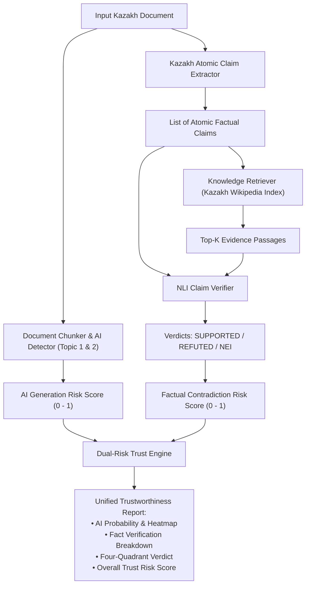

# Technical Design: Evidence-Grounded Factual Verification for Low-Resource Kazakh (Topic 3)

**Author:** Da Lei  
**Date:** September 11, 2026  
**Status:** Approved for Implementation  
**Target:** Master's Thesis Topic 3 & Paper 2 (Target: Top-Tier NLP Conference)  

---

## 1. Research Motivation & Problem Statement

Current AI text detectors focus entirely on stylistic and distribution signals (e.g. perplexity, subword entropy, morphemic regularity). However, in high-stakes contexts (news verification, educational integrity, scientific publishing):
1. **AI-generated text can be factually accurate** (e.g., automated sports summaries or encyclopedic explanations).
2. **Authentic human text can contain misinformation, factual errors, or rumors**.

Relying exclusively on AI probability creates a critical operational blindspot. **Topic 3** resolves this by introducing an **Evidence-Grounded Factual Verification Engine** for Kazakh. It pairs the dual-stream neural AI detector (Topics 1 & 2) with an encyclopedic retrieval and Natural Language Inference (NLI) pipeline that evaluates claims against verified Kazakh Wikipedia knowledge:

$$\text{Overall Trust Risk} = \alpha \cdot \text{Risk}_{\text{AI}} + (1 - \alpha) \cdot \text{Risk}_{\text{Fact}}$$

---

## 2. System Architecture

The verification engine consists of five modular subsystems:



---

## 3. Subsystem Detailed Specifications

### Subsystem 1: The Knowledge Store & Inverted Index (`verification/knowledge_store.py`)
- **Reference Corpus**: Sourced from verified Kazakh Wikipedia articles spanning history, geography, economy, culture, and science.
- **Passage Segmentation**: Articles are segmented into 2–3 sentence factual context windows ($L \approx 40\text{--}80$ words).
- **Morphologically Stemmed Inverted Index**:
  - Because Kazakh is highly agglutinative, standard character-level or subword inverted indices fail when query words carry different case affixes than the corpus (e.g., *Алматының*, *Алматыға*, *Алматыда*).
  - All index keys are extracted using `AdvancedKazakhFSTAnalyzer.extract_root_and_affixes()`.
  - The inverted index maps `root_stem -> [(passage_id, term_frequency), ...]`.

### Subsystem 2: Hybrid Evidence Retriever (`verification/retriever.py`)
- **Stage 1 (Sparse BM25 Search)**:
  - Query claims are segmented and stemmed into root tokens $Q = \{q_1, q_2, \dots, q_m\}$.
  - Scores passages using Okapi BM25 with $k_1 = 1.5, b = 0.75$:
    $$\text{BM25}(D, Q) = \sum_{q \in Q} \text{IDF}(q) \cdot \frac{f(q, D) \cdot (k_1 + 1)}{f(q, D) + k_1 \cdot \left(1 - b + b \cdot \frac{|D|}{\text{avgdl}}\right)}$$
  - Retrieves top $N=20$ candidate passages.
- **Stage 2 (Dense Reranking)**:
  - Reranks top candidates using normalized semantic vector cosine similarity.
  - In neural environments: uses cross-lingual sentence embeddings (`multilingual-e5-small` or similar).
  - In CPU/offline environments: employs defensive fallback with normalized TF-IDF semantic cosine similarity.
- **Output**: Ranked `List[EvidencePassage]`, each containing `passage_id`, `title`, `text`, `similarity_score`, and `matched_stems`.

### Subsystem 3: Kazakh Atomic Claim Extractor (`verification/claim_extractor.py`)
- **Sentence Segmentation**: Uses `SentencePreservingChunker` with Kazakh abbreviation guards (*т.б.*, *ж.б.*, *ғ.*, *ғғ.*, *ж.*, *жж.*, *қ.*, *мыс.*, *проф.*, *акад.*) and dialogue quote tracking.
- **Subjective & Discourse Hedge Stripping**: Strips conversational and epistemic hedges (*Меніңше*, *Менің ойымша*, *Өкінішке орай*, *Айта кету керек*, *Байқағанымдай*, *Шындығында*) to isolate verifiable factual assertions.
- **Compound Clause Decomposition**:
  - Splits complex sentences along coordinating conjunctions (*және*, *әрі*, *бірақ*, *ал*, *дегенмен*).
  - Propagates subject head nouns into coordinate sub-clauses when ellipted.
- **Factual Verifiability Filter**:
  - Requires each candidate proposition to contain at least one entity or noun root stem and a predicate verb or copula (*болып табылады*, *болды*, *құрылды*, *орналасқан*, *атанды*).
  - Minimum length threshold: $\ge 3$ content words.

### Subsystem 4: NLI Claim Verifier Engine (`verification/nli_verifier.py`)
- Given claim $C$ and top evidence passage $E$:
- **Classifies into 3 Labels**:
  - `SUPPORTED`: Evidence confirms the claim.
  - `REFUTED`: Evidence directly contradicts the claim.
  - `NOT ENOUGH INFO`: Evidence neither confirms nor refutes the claim, or is insufficiently relevant.
- **Contradiction Detection Modules**:
  1. **Numerical & Temporal Conflict**: Compares years, dates, and quantitative values. If numerical entities conflict (e.g. claim: *1995*, evidence: *1991*), the module triggers a `REFUTED` verdict.
  2. **Morphological Negation Mismatch**: Detects verbal negation suffixes (`-ба/-бе`, `-па/-пе`, `-ма/-ме`, `-баған/-беген`) and negative particles (*емес*, *жоқ*). If polarity differs between claim and evidence, returns `REFUTED`.
  3. **Entity Alignment & Semantic Entailment**: Computes directional entailment score. If key subject/object entities match and the predicate relations align with high confidence ($\ge 0.70$), returns `SUPPORTED`.

### Subsystem 5: Dual-Risk Trust Scorer & Four-Quadrant Matrix (`verification/trust_scorer.py`)
- **Factual Contradiction Penalty**:
  $$\text{Penalty}(\text{verdict}) = \begin{cases} 0.0, & \text{if SUPPORTED} \\ 0.25, & \text{if NOT ENOUGH INFO} \\ 1.0, & \text{if REFUTED} \end{cases}$$
- **Document Factual Risk**:
  $$\text{Risk}_{\text{Fact}} = \frac{1}{\sum_{i=1}^M w_i} \sum_{i=1}^M w_i \cdot \text{Penalty}(\text{verdict}_i)$$
- **Overall Dual-Risk Formula**:
  $$\text{Risk}_{\text{Trust}} = \alpha \cdot \text{Risk}_{\text{AI}} + (1 - \alpha) \cdot \text{Risk}_{\text{Fact}} \quad (\alpha \in [0, 1], \text{default } \alpha = 0.50)$$
- **The Four-Quadrant Trust Matrix**:
  1. **Verified Human Fact** ($\text{Risk}_{\text{AI}} < 0.50 \land \text{Risk}_{\text{Fact}} < 0.40$): High trust, authentic human scholarship.
  2. **Human Misinformation** ($\text{Risk}_{\text{AI}} < 0.50 \land \text{Risk}_{\text{Fact}} \ge 0.40$): Human text containing factual errors or rumors.
  3. **Accurate AI Synthesis** ($\text{Risk}_{\text{AI}} \ge 0.50 \land \text{Risk}_{\text{Fact}} < 0.40$): Machine-generated, but factually grounded.
  4. **Hallucinatory AI Disinformation** ($\text{Risk}_{\text{AI}} \ge 0.50 \land \text{Risk}_{\text{Fact}} \ge 0.40$): High-risk machine fabrication.

---

## 4. Benchmark: Kazakh-FEVER Protocol (`verification/fever_generator.py` & `evaluator.py`)

To evaluate the system rigorously:
- **Synthetic Ground-Truth Construction**:
  - `SUPPORTED`: True factual sentences extracted directly from Kazakh Wikipedia.
  - `REFUTED`: Controlled factual mutations:
    - *Temporal/Numerical Mutation*: Dates and quantities altered ($1991 \to 1995$).
    - *Entity Mutation*: Proper nouns substituted (*Астана \to Шымкент*).
    - *Negation Mutation*: Verb polarity inverted with FST negation affixes.
  - `NOT ENOUGH INFO`: Unrelated claims paired with distractor passages.
- **Evaluation Metrics**:
  - **Retrieval Recall@5**: Proportion of queries where the true reference passage is retrieved in top 5.
  - **NLI 3-Class Macro-F1**: Precision, Recall, and Macro-F1 across `SUPPORTED`, `REFUTED`, and `NEI`.
  - **FEVER Score**: Joint accuracy requiring both correct evidence retrieval and correct label assignment.

---

## 5. Directory & File Organization

```
kazakh-ai-text-detection/
├── verification/
│   ├── __init__.py
│   ├── evidence.py            # Data structures (EvidencePassage, AtomicClaim, VerificationResult)
│   ├── knowledge_store.py     # Reference corpus manager & FST-stemmed inverted index
│   ├── retriever.py          # BM25 sparse + dense reranking evidence retriever
│   ├── claim_extractor.py     # Kazakh sentence-to-atomic claim decomposition
│   ├── nli_verifier.py        # 3-way NLI engine with numerical & negation contradiction logic
│   ├── trust_scorer.py        # Dual-risk fusion & 4-quadrant categorization
│   ├── fever_generator.py     # Kazakh-FEVER synthetic dataset generation engine
│   └── evaluator.py           # Recall@K, Macro-F1, and FEVER score calculation
├── data/
│   ├── kazakh_knowledge_corpus.jsonl  # Curated reference Wikipedia corpus
│   └── kazakh_fever_benchmark.jsonl   # Labeled Kazakh-FEVER benchmark
└── tests/
    ├── test_knowledge_store.py
    ├── test_claim_extractor.py
    ├── test_nli_verifier.py
    ├── test_trust_scorer.py
    └── test_kazakh_fever.py
```

---

## 6. Constraints & Invariants

1. Under no circumstances modify `aist2026/paper.tex`.
2. Clean UTF-8 encoding across all Kazakh Cyrillic strings.
3. Strict zero-emoji policy in all algorithmic outputs, reports, and logs.
4. Defensive execution: The verification engine must operate reliably on standard CPU hardware with graceful fallbacks.
5. 100% test pass rate across all existing 241 unit tests.
